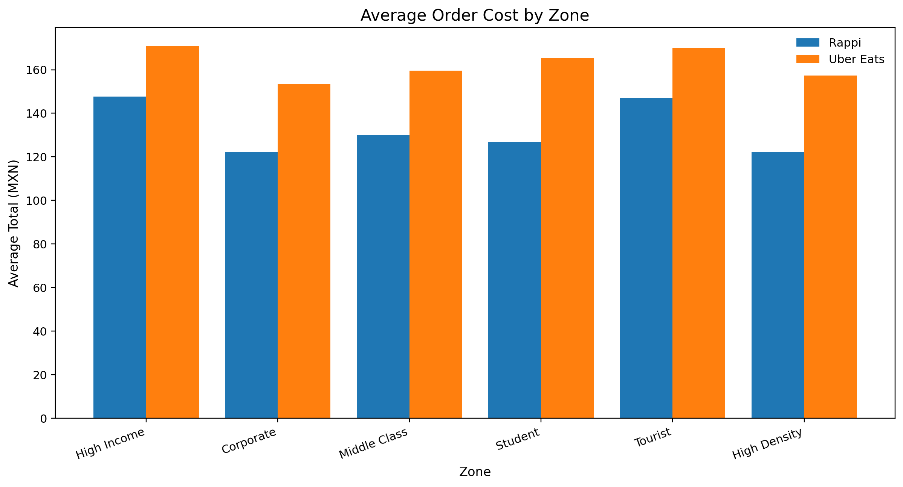
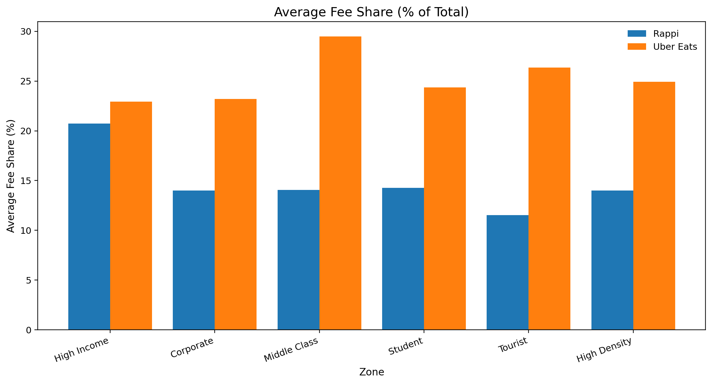
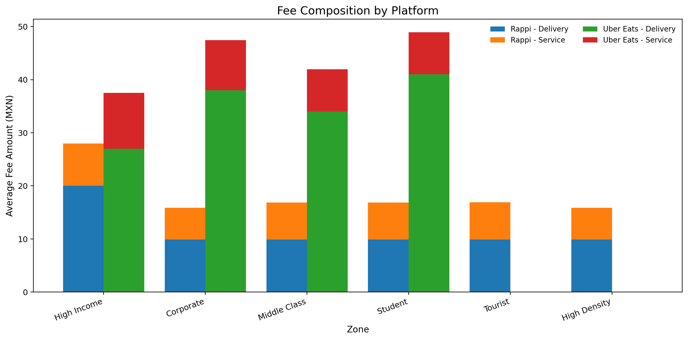
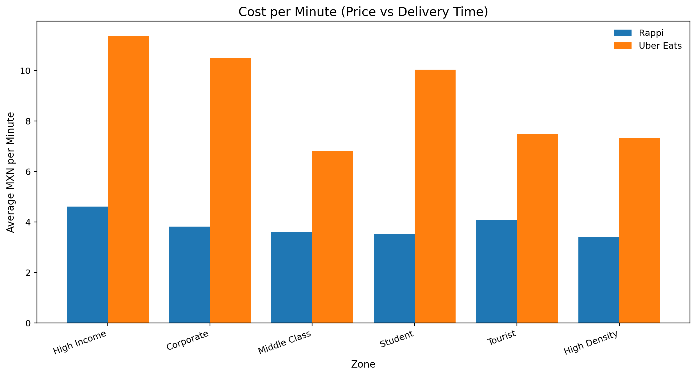

# Competitive Pricing Intelligence: Rappi vs Uber Eats
End-to-end system to extract, normalize, and analyze checkout-level pricing data across delivery platforms.

## Overview
This project implements a checkout-level competitive pricing pipeline comparing **Rappi** and **Uber Eats**.

It captures real pricing data directly from each platform checkout flow, including:
- Product price (`subtotal`)
- Delivery fee
- Service fee
- Total order cost
- Estimated delivery time (ETA)

The objective is to move beyond visible menu pricing and understand how each platform monetizes through fee structure and delivery dynamics.

## Key Insights
- Uber Eats orders trend higher than Rappi in several zones.
- The biggest gap is typically fee-driven (especially delivery).
- Fee share can represent a substantial portion of final order value in some areas.
- Faster ETA does not always justify a higher total checkout cost.

## Example Analysis
The analysis pipeline produces high-signal comparison charts across zones and platforms:
- Average total order cost
- Average fee share (% of total)
- Fee composition (delivery vs service)
- Cost per minute (price vs delivery time)

### 1) Average Order Cost by Zone


### 2) Average Fee Share (% of Total)


### 3) Fee Composition by Platform


### 4) Cost per Minute (Price vs Delivery Time)


## Architecture
The system is split into three layers:

| Layer | Inputs | Core Output |
| --- | --- | --- |
| Data Collection | Address + product jobs | Checkout-level normalized JSON |
| Data Processing | Raw platform outputs | Unified CSV + derived metrics |
| Analysis & Visualization | Unified CSV | Comparison charts for presentation |

### 1. Data Collection (Scrapers)
- Rappi scraper
- Uber Eats scraper

Each scraper:
- Navigates the full checkout flow
- Extracts structured pricing fields
- Writes normalized results

### 2. Data Processing
- Cleans and unifies platform outputs
- Computes derived metrics:
- `fee_share_pct`
- `fee_total`
- `total_per_minute`

### 3. Analysis & Visualization
- Aggregates normalized CSV data
- Generates presentation-ready charts with Matplotlib
- Supports cross-zone and cross-platform comparison

## Design Approach
The project evolved in two phases:

### Phase 1 - Functional Prototype (Rappi)
- Focus: end-to-end reliability
- Result: stable extraction and repeatable outputs

### Phase 2 - Modular Rebuild (Uber Eats)
- Focus: maintainability and synchronization quality
- Improvements:
- State-driven navigation instead of blind waits
- Separation of concerns (flow, selectors, readiness, product logic)
- Cleaner platform-adapter architecture

## Data Schema
Each normalized record includes:
- `platform`
- `zone_type`
- `address`
- `product`
- `restaurant`
- `subtotal`
- `delivery_fee`
- `service_fee`
- `total`
- `eta_avg_minutes`
- `fee_share_pct`
- `total_per_minute`
- `status`

## How to Run
1. Install dependencies:
```bash
python -m pip install -r Rappi-AI-Insights/requirements.txt
```

2. Create login state once per platform (manual login bootstrap):
```bash
cd Rappi-AI-Insights
python auth/login_once_rappi.py
python auth/login_once_ubereats.py
```
This generates reusable session files:
- `Rappi-AI-Insights/auth/state_rappi.json`
- `Rappi-AI-Insights/auth/state_ubereats.json`

3. Configure scraping scope before running:
- Edit `Rappi-AI-Insights/rappi/config.py`:
- `PRODUCTS` (items to scrape)
- `ADDRESSES` (zones/addresses to scrape)
- Edit `Rappi-AI-Insights/ubereats/config.py`:
- `PRODUCTS` (items to scrape)
- `ADDRESSES` (zones/addresses to scrape)

4. Run scrapers:
```bash
python -m rappi.main
python -m ubereats.main
```

5. Build unified CSV:
```bash
python analysis/analysis_checkout.py
```

6. Generate charts:
```bash
python analysis/create_charts.py
```

## Debug Artifacts
Both scrapers store run evidence to support reproducibility and debugging:
- Screenshots:
- `Rappi-AI-Insights/data/rappi/screenshots/runs/...`
- `Rappi-AI-Insights/data/ubereats/screenshots/runs/...`
- Network captures:
- `Rappi-AI-Insights/data/rappi/network/...`
- `Rappi-AI-Insights/data/ubereats/network/runs/...`
- Result JSONs:
- `Rappi-AI-Insights/data/rappi/results/checkout_result_rappi.json`
- `Rappi-AI-Insights/data/ubereats/results/checkout_result_ubereats.json`

## Limitations
- Uber Eats UI can change frequently, affecting selector stability.
- Coverage can be partial for some zone/product combinations.
- Dynamic client-side rendering may still introduce intermittent failures.

## Next Steps
- Improve retry/resilience logic for unstable UI branches.
- Unify both scrapers under a stricter common adapter interface.
- Add automated run reports (coverage, success rate, extraction quality).
- Expand to more restaurants and product categories.

## Tech Stack
- Python
- Playwright
- Pandas
- Matplotlib
